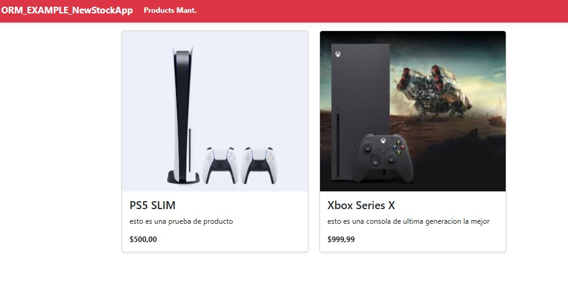

# Nombre del Proyecto

Esto es un proyecto con la arquitectura de MVC desarrollada en .NET y blazor
aqui termine desarrollando un CRUD de productos y categorias
y aprendiendo lo que es el ORM de entity framework para la gestion de la base de datos
y el tema de las migraciones de la base de datos

## Características principales

- CRUD de productos y categorias
- Migraciones de la base de datos

## Tecnologías utilizadas

- ASP.NET
- Entity Framework
- Blazor
- SQL Server

## Instalación

Instrucciones claras para clonar y configurar el proyecto localmente:

```bash
# Clonar el repositorio
git clone https://github.com/Darlyn30/MVC_ASP_.NET.git

## Acceder al directorio
cd MVC_ASP_.NET

## Instalar dependencias

# Instalar el paquete principal de Entity Framework Core
dotnet add package Microsoft.EntityFrameworkCore

# Instalar el proveedor para SQL Server
dotnet add package Microsoft.EntityFrameworkCore.SqlServer

# Instalar las herramientas para migraciones
dotnet add package Microsoft.EntityFrameworkCore.Tools

# Instalar el paquete de diseño (necesario para migraciones y scaffolding)
dotnet add package Microsoft.EntityFrameworkCore.Design


# Ejecutar el proyecto
dotnet run

## Visual de la Aplicacion



# ALL RIGHTS RESERVED
