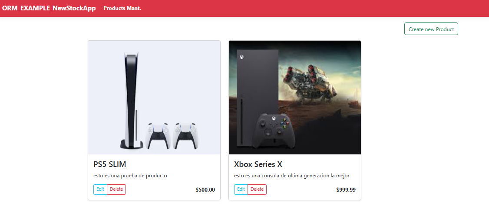
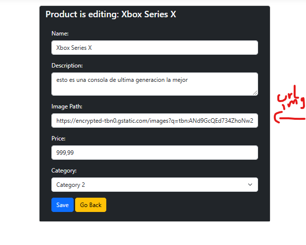
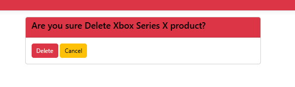

# ORM_EXAMPLE_NewStockApp

Esto es un proyecto con la arquitectura de MVC desarrollada en .NET y blazor
aqui termine desarrollando un CRUD de productos y categorias
y aprendiendo lo que es el ORM de entity framework para la gestion de la base de datos
y el tema de las migraciones de la base de datos

## Características principales

- CRUD de productos y categorias
- Migraciones de la base de datos

## Tecnologías utilizadas

- ASP.NET
- Entity Framework
- Blazor
- SQL Server

## Instalación

```bash
# Clonar el repositorio
git clone https://github.com/Darlyn30/MVC_ASP_.NET.git

## Acceder al directorio
cd MVC_ASP_.NET

## **DEPENDECIAS NECESARIAS
```
*Database
# Entity Framework Core
# Entity Framework Core SQL Server
# Entity Framework Tools
*WebApi
# Entity Framework Design

```bash
# Ejecutar el proyecto
dotnet run
```

## Visual de la Aplicacion






# &copy; ALL RIGHTS RESERVED (Darlyn30) 2025
